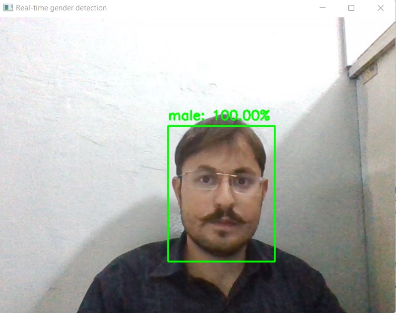

# Gender-Detection-using-OpenCV
Gender detection is one of the popular computer vision applications. When you use a camera to detect a person’s gender instead of detecting it on a picture, it can be said to be a realtime gender detection system. I hope you liked this article on Realtime Gender Detection using Python. Feel free to ask your valuable questions in the comments section below.

## Real-time Gender Detection System
To create a gender detection system using Python, we need to train a model with some high-level features of the face of human beings such as:

#### 1) The distance between eyes, nose, and mouth
#### 2) Measurements of different parts of the face of both the genders

There are many libraries and frameworks in Python that can be used to create a real-time gender detection system. Some of these libraries include Yolo, Tensorflow, OpenCV, and Cvlib. So here I am going to use the Cvlib library in Python that can be used to detect the gender of a person in a few lines of code.

Along with Cvlib, I will also be using the OpenCV library in Python so that we can detect a person’s gender using a webcam. So here is how to install both libraries on your system using the pip command:

pip install opencv-python

pip install cvlib
